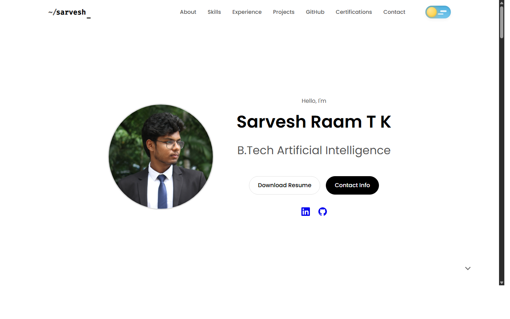

# Sarvesh Raam T K - Portfolio Website

A premium, ultra-minimal, Apple-inspired portfolio website showcasing AI engineering work.

<div align="center">
  
</div>
## Quick Start

### Option 1: Open Directly (Simplest)
Simply double-click `index.html` to open it in your default browser.

### Option 2: Local Server (Recommended for GitHub API)
For the best experience with real-time GitHub integration:

```bash
# Using Python (if installed)
python -m http.server 8000

# Using Node.js (if installed)
npx http-server -p 8000

# Using PHP (if installed)
php -S localhost:8000
```

Then open: `http://localhost:8000`

## File Structure

```
portfolio/
├── index.html      # Main HTML structure
├── style.css       # Apple-inspired design system
├── script.js       # Animations & GitHub API integration
└── README.md       # This file
```

## Features

- **Ultra-Clean Design**: Apple-inspired aesthetics with generous white space
- **Smooth Animations**: Gentle fade-ins and hover effects
- **Real-Time GitHub**: Automatically fetches and displays your latest repositories
- **Fully Responsive**: Mobile-first design that works on all devices
- **Smart Contact**: All contact links work correctly (email, phone, WhatsApp, social)
- **Performance Optimized**: Fast loading with lazy loading and efficient code

## Customization

### Update Projects
Edit the project cards in `index.html` (lines ~85-130) to showcase your best work.

### Update Case Study
Modify the case study section in `index.html` (lines ~135-165) with your own project story.

### Adjust Colors
All colors are defined as CSS variables in `style.css` (lines 1-30). Change them to match your preference.

### GitHub Integration
The site automatically fetches repositories from `https://github.com/sarvesh-raam`. 
To change the username, edit line 28 in `script.js`.

## Contact Information

All contact links are fully functional:
- **Email**: Opens default mail client
- **Phone**: Opens dialer on mobile devices
- **WhatsApp**: Opens WhatsApp chat
- **GitHub**: Links to your profile
- **LinkedIn**: Links to your profile

## Technical Details

- **No Build Process**: Pure HTML, CSS, and JavaScript
- **No Dependencies**: Everything works out of the box
- **SEO Optimized**: Proper meta tags and semantic HTML
- **Accessible**: ARIA labels and keyboard navigation support
- **Cross-Browser**: Works on Chrome, Firefox, Safari, Edge

## Notes

- GitHub API has a rate limit of 60 requests/hour for unauthenticated requests
- The site caches repository data to minimize API calls
- All animations use hardware-accelerated CSS transforms for smooth performance

## Philosophy

> "Calm, confident, and premium. Let the work speak for itself."

This portfolio follows Apple's design principles:
- Minimal content, maximum clarity
- Generous white space
- Thoughtful micro-interactions
- Focus on what matters

---

Built with focus and clarity by Sarvesh Raam T K
